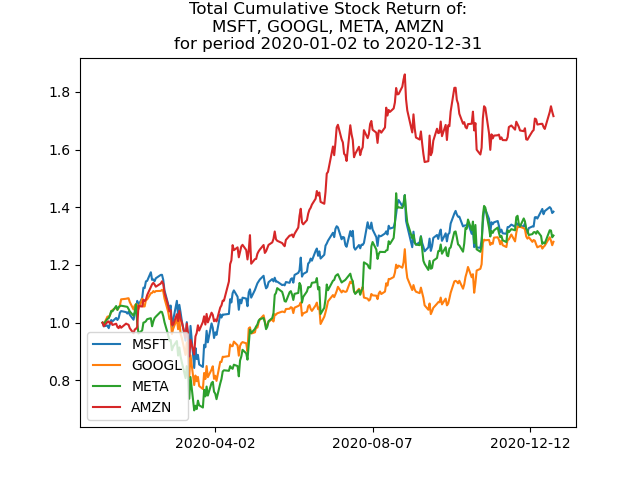

# Big Data course project

Author: Bojan Poprzen, E2 4/2022

This GitHub repo contains the final project of the Big Data course.

It contains 2 sub-folders:
1. `batch` contains an example of batch processing large amounts of raw data and getting something useful out of it. What you get is a nice graph showing how any given stocks performed over any given period of time.

2. `stream` contains an example of stream processing large amounts of incoming data. What you get is a nice dashboard showing how given stocks are currently performing and what is a *dumb* prediction what their price will be in the following instance. It is connected to the live stock market.

READMEs in these two folders give instructions how to run each of the processing.