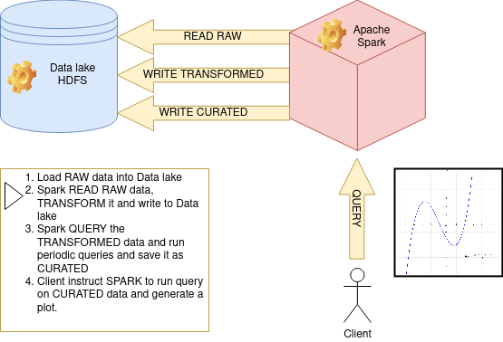
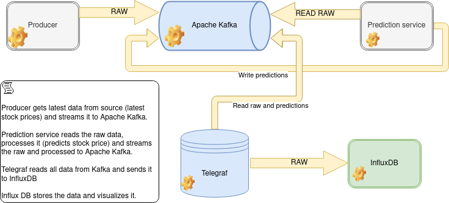

# Big Data course project

Author: Bojan Poprzen, E2 4/2022

This GitHub repo contains the final project of the Big Data course.

It contains 2 sub-folders:
1. `batch` contains an example of processing large amounts of raw data. It uses Apache Spark to efficiently run queries on data stored in Apache Hadoop.
2. `stream` contains an example of stream processing of large amounts of data. It uses Apache Kafka, custom producers and consumers and InfluxDB as a time-series DB and visualization engine.

## Batch processing

## Stream processing

