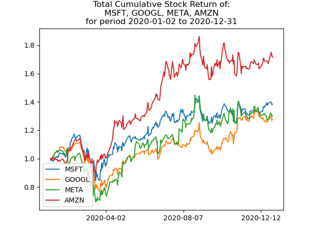

# Batch processing

This folders gives an example of how to process large amounts of data and get something useful out of it. What you can get out of this is a nice graph showing how given stocks performed over a given period of time.



## Architecture

Batch processing uses Apache Spark to efficiently run queries on stock data stored in Apache Hadoop.


## Data sizes

```bash
# All folders in Hadoop.
root@c8551e971c8e:/$ hdfs dfs -ls /
Found 4 items
drwxr-xr-x   - root supergroup          0 2024-01-25 17:57 /curated
drwxr-xr-x   - root supergroup          0 2024-01-18 10:51 /data
drwxr-xr-x   - root supergroup          0 2024-01-25 17:00 /query
drwxr-xr-x   - root supergroup          0 2024-01-25 12:48 /transformed

# Raw data.
root@c8551e971c8e:/$ hdfs dfs -du -h -s /data
2.9 G  8.8 G  /data

# Transformed (cleansed) data.
root@c8551e971c8e:/ hdfs dfs -du -h -s /transformed
957.7 M  2.8 G  /transformed

# Curated data.
root@c8551e971c8e:/$ hdfs dfs -du -h -s /curated
2.2 G  6.5 G  /curated

# Queried data.
root@c8551e971c8e:/$ hdfs dfs -du -h -s /query
21.2 K  63.7 K  /query
```

## Scripts

### Downloading raw data and loading it into HDFS

This script downloads all daily stock data for all NASDAQ stocks. It takes around 20mins.

```bash
#!/bin/bash

# Run Apache Hadoop and Apache Spark services.
docker compose up -d

# Setup python environment for raw data download.
python -m venv env
source env/bin/activate
pip install -r requirements.txt

# Setup folders for keeping the raw data.
SCRIPT=$(realpath "$0")
SCRIPTPATH=$(dirname "$SCRIPT")
mkdir -p $SCRIPTPATH/data/stocks

# Download raw data to the set-up folders.
time python download_data.py

# Save raw data in Apache Hadoop file system.
docker cp $SCRIPTPATH/data namenode:/home
docker exec -it namenode bash -c "hdfs dfsadmin -safemode leave"
docker exec -it namenode bash -c "hdfs dfs -mkdir /data"
docker exec -it namenode bash -c "hdfs dfs -mkdir /data/stocks"
docker exec -it namenode bash -c "hdfs dfs -mkdir /data/curated"
docker exec -it namenode bash -c "hdfs dfs -put -t 12 /home/data/stocks/* /data/stocks"
```

### Transforming (cleaning) raw data

This script cleans the raw data - removes data that isn't needed, drops missing data and merges all the files by adding `Ticker` field denoting the security symbol. This eases further processing. It takes only 1min.

```bash
docker exec -it spark-master bash -c "/spark/bin/spark-submit /home/transform.py"
```

### Generating curated data

This script generates Cumulative Total Stock Return for each of the security for the last 5 years. It takes around 2.5mins.

```bash
docker exec -it spark-master bash -c "/spark/bin/spark-submit /home/query.py"
```

### Submit client queries and visualize

Running this generates a plot of Cumulative Total Stock Return for a list of Securities for any time period in the last 5 years. It takes a few seconds.

```bash
# Get Cumulative Total Stock Return for Microsoft, Google, Meta and Amazon for year 2022.
docker exec -it spark-master bash -c "/spark/bin/spark-submit /home/user_query.py MSFT,GOOGL,META,AMZN 2022-01-01 2022-12-31"

# Pull the query result out from HDFS and visualize it locally - this could be automated by using HDFS API.
docker exec -it namenode bash -c "rm -rf ~/query_results/result.csv"
docker exec -it namenode bash -c "hdfs dfs -copyToLocal /query/query.csv/*.csv ~/query_results/result.csv"
python visualize.py
```