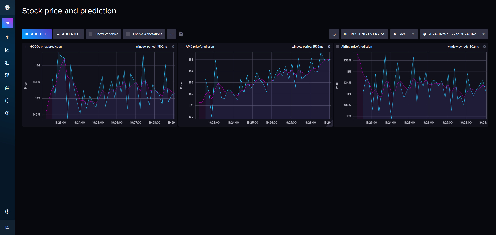
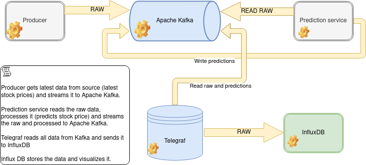

# Stream processing

This folder contains an example of stream processing large amounts of incoming data. What you get is a nice dashboard showing how given stocks are currently performing and what is a *dumb* prediction what their price will be in the following instance. It is connected to the live stock market.



## Architecture

Stream processing uses Apache Kafka, custom producers and consumers and InfluxDB as a time-series DB and visualization engine.



## Scripts

```bash
docker compose rm -svf
docker compose up
# After a few minutes open localhost:8086 to see InfluxDB.
```